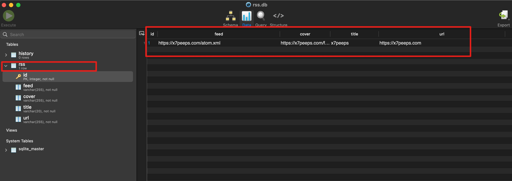

# rss2dingtalk

rss2dingtalk是一个简单的用于同步rss订阅资讯到钉钉群机器人的脚本。常用于团队日常订阅资讯使用。
## Getting Started
### Prerequisites
* 操作系统: macOS, Linux, Windows
* 具备的开发环境：python3.X
### Usage 
1. pip3 install -r requirements.txt；
2. 打开rss.py, 将钉钉机器人的自定义webhook以及seccode填写到rss.py中；
3. 维护rss.db，将需要订阅的rss资源填写到rss表项中即可；

4. Have fun.

